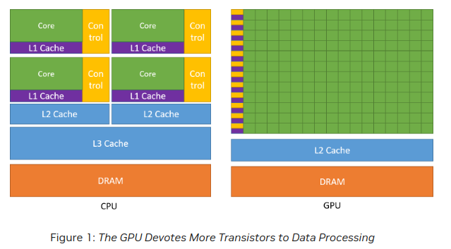
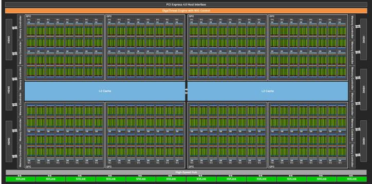
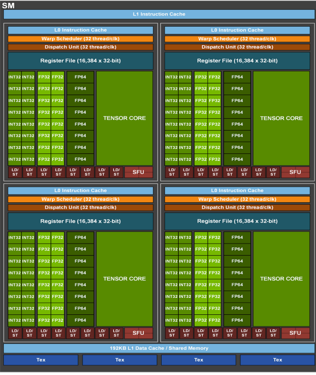
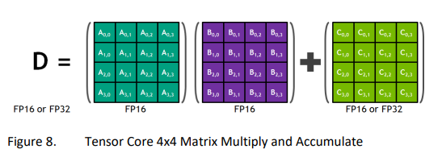
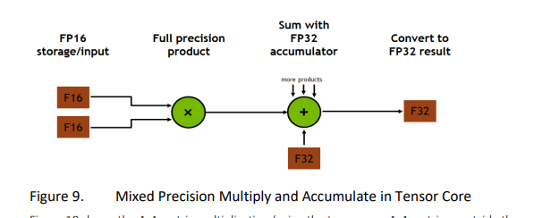

# NVIDIA Architecture
---

## Difference between CPU and GPU




More trasistors dedicated to computation rather than caching and flow control as in CPU.

## NVIDIA GPU Architecture



Ampere Architecture

### Streaming Multiprocessor (SM)
Streaming Multiprocessor (SM) is the basic building block of the GPU. It consists of multiple CUDA cores, shared memory, and L1 cache. The SM is responsible for executing the threads of a CUDA kernel.


Each SM contains:

- Multiple CUDA cores
- Shared memory
- Cache
- Tensor cores (in modern architectures)
- Load/Store units
- Special Function Units (SFU)

### Warp
Warp is a group of 32 threads that are executed in parallel on the SM. The threads in a warp execute the same instruction at the same time. The threads in a warp are executed in SIMD (Single Instruction, Multiple Data) fashion.

### CUDA Cores

Each CUDA core is essentially a small processor that can handle:

- Integer arithmetic operations (ADD, SUB, etc.)
- Floating-point operations (FP32 primarily)
- Logic operations (AND, OR, XOR, etc.)

### Tensor Cores



Tensor cores perform the operation

$$
D = A \times B + C
$$

where $A$, $B$, $C$, and $D$ are 4x4 matrices. size of A is $m \times k$, size of B is $k \times n$, size of C is $m \times n$ and size of D is $m \times n$ and the problem size is generally defined as $ m \times n \times k$. 
 The operation is performed in a single instruction. Here the input can be of FP16 or FP32. here the multplication happens at FP16, However the accumulation (when the results of the multiplication are added) is where the precision can be increased to FP32 (if needed). In Ampere, the tensor operation size is $ 8 \times 4 \times 8$ and in past architectures like Volta, the tensor operation size was $4 \times 4 \times 4$.




### Precision

BF-16 is called BrainFloating points. Gets the same dynamic range as the FP32, with haf the memory. It does by dropping precision(decimal places). However, in deeplearning, range is more important than precision.

``` 
BF16: 1-bit sign | 8-bit exponent | 7-bit mantissa
FP32: 1-bit sign | 8-bit exponent | 23-bit mantissa
FP16: 1-bit sign | 5-bit exponent | 10-bit mantissa
```

Format  | Range           | Precision
--------|----------------|------------
FP32    | ±3.4e38       | ~7 decimal
BF16    | ±3.4e38       | ~2-3 decimal
FP16    | ±65504        | ~3-4 decimal


## GPU In Numbers
---

As of Feb-17,2025, the latest architecture is **Blackwell**. 
# NVIDIA GPU Architecture Comparison - Ampere vs Blackwell

| Specification | Ampere (A100) | Blackwell (GB200) |
|--------------|----------------|-------------------|
| Year of Release | 2020 | 2024 |
| Top GPU Model | A100 | GB200 |
| Number of SMs | 108 | 192 (2 GPUs per Superchip) |
| CUDA Cores per SM | 64 | 128 |
| Tensor Cores per SM | 4 | 8 |
| Device Memory | 80GB HBM2e | Up to 384GB HBM3e |
| L2 Cache | 40MB | 192MB shared |
| L1 Cache per SM | 192KB | 256KB |

## Key Innovations in Ampere (A100)

* First implementation of sparsity support in Tensor Cores, enabling up to 2x acceleration for sparse neural networks

* Introduction of Third-Generation Tensor Cores with support for new TF32 format

* Multi-Instance GPU (MIG) technology enabling secure GPU partitioning

* HBM2e memory with up to 2TB/s bandwidth

* NVLink with 600GB/s bidirectional bandwidth

* Support for FP64 tensor core operations for HPC workloads

* Unified memory architecture with L2 cache improvements

## Key Innovations in Blackwell (GB200)

* Second-Generation Transformer Engine with FP4/FP6 Tensor Core technology, optimized for LLM workloads

* Built on TSMC's 4NP process with 208 billion transistors (2.5x more than Hopper)

* Fifth-Generation NVLink with 1.8TB/s bidirectional bandwidth per link

* Decompression Engine capable of 800 GB/sec throughput

* RAS Engine for 100% in-system self-test and predictive maintenance

* Confidential Computing capabilities with hardware-level security

* New NVLink Switch enabling 130TB/s GPU bandwidth in one 72 GPU domain

## Performance Highlights

* For database operations, GB200 delivers up to 18x faster performance compared to x86 CPUs
* Real-time inference shows 30x speedup compared to previous generation
* Training performance shows 4x improvement for LLM workloads
* Energy efficiency improved with 25x lower TCO compared to previous generation
* Database query performance improved by up to 18x compared to CPU-based systems

_Note: Specifications are based on official NVIDIA documentation, with a focus on the primary features and innovations of each architecture._

## References

1. [NVIDIA Docs](https://docs.nvidia.com/cuda/cuda-c-programming-guide/index.html)
2. [NVIDIA Ampere White paper](https://images.nvidia.com/aem-dam/en-zz/Solutions/data-center/nvidia-ampere-architecture-whitepaper.pdf)
3. [NVIDIA Volta White paper](https://images.nvidia.com/content/volta-architecture/pdf/volta-architecture-whitepaper.pdf)
4. [NVIDIA Data center tech](https://www.nvidia.com/en-in/data-center/technologies/blackwell-architecture/)