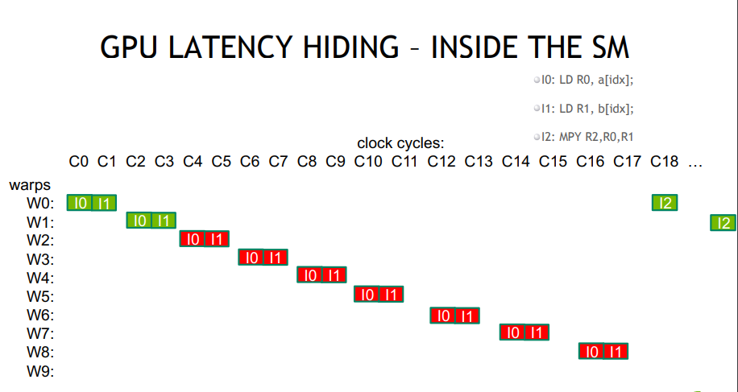

# Optimisation in CUDA
---

### Intuition:

- There is always latency involved in loading memory etc. 
- Instructions are issued in order.
- The latency is hidden by switching threads. So higher number of threads is usefull.

### Latency hiding

#### Example:
``` In CUDA C source code:
int idx = threadIdx.x+blockDim.x*blockIdx.x;
c[idx] = a[idx] * b[idx];
```

In machine code:
```
I0: LD R0, a[idx];
I1: LD R1, b[idx];
I2: MPY R2,R0,R1
```



Note: need more threads, so that at every clockcycle some work is done instead of waiting. 

## Optimal Launch Configuration

- Need enough total threads to keep GPU busy
    - Typically, you’d like 512+ threads per SM (aim for 2048 - maximum “occupancy”)
        - More if processing one fp32 element per thread
    - Of course, exceptions exist
### Threadblock configuration
- Threads per block should be a multiple of warp size (32)
- SM can concurrently execute at least 16 thread blocks (Maxwell/Pascal/Volta: 32)
    -  Really small thread blocks prevent achieving good occupancy
    - Really large thread blocks are less flexible
    - Could generally use 128-256 threads/block, but use whatever is best for the application
