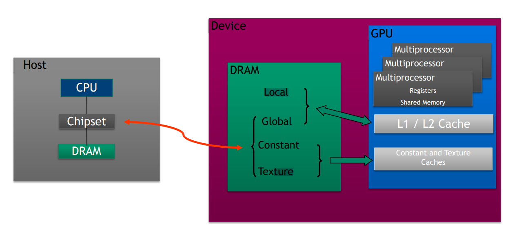
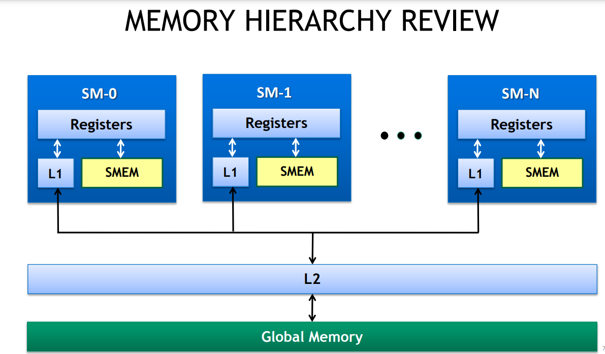

# Memory Hierarchy - CUDA
---






### Load Hierarchy

- Loads:
Caching
Default mode
    - Attempts to hit in L1, then L2, then GMEM
    - Load granularity is 128-byte line
- Stores:
    - Invalidate L1, write-back for L2

## Shared Memory
---

Shared memory resides in `L1` cache, which is unique to each blocks. All threads in blocks can access them; Not shared between the threads.  typically up to 48KB shared (or 64KB, or 96KB…)

### Why Shared Memory

- Accessible by all threads as well as host (CPU)
- High latency (hundreds of cycles)
- Throughput: up to ~900 GB/s (Volta V100)

### Static Allocation
- Static : use `__shared__`
For Eg: `__shared__ int sdata[SIZE]`

### Dynamic Allocation
3rd parameter in the kernel call is the memory to be dynamically allocated

- Kernel call:
```kernel<<<Num_blocks, num_threds, size>>>();```

- within kernel
```extern __shared__ int sdata[];``` 

### SyncThreads

Since each thread might be copying a value to shared memory, which some other thread might access for calculation. Always sync threads. 
    