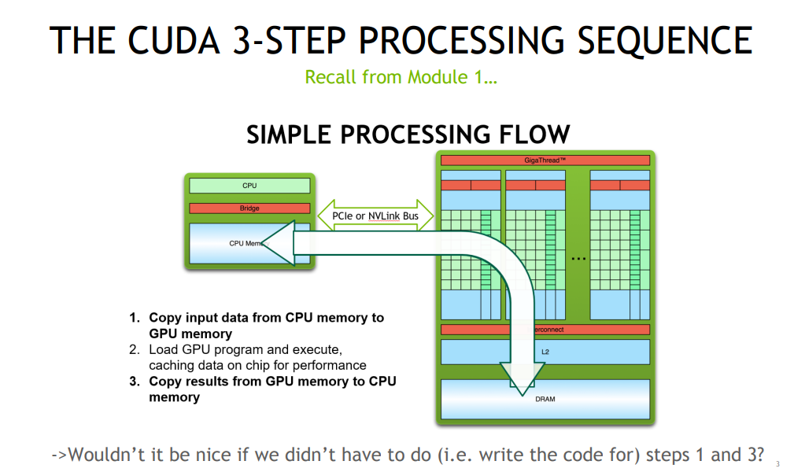

# CudaMallocHost Vs Unified Vs NormalMalloc
----

## Section 1: CudaMallocHost: Paged Memory:

Page-locked memory is a memory that is locked in physical memory, preventing the system from swapping it out to disk. This is useful when you want to transfer data between the host and device quickly. Page-locked memory is allocated using `cudaMallocHost` or `cudaHostAlloc` functions. The memory allocated using these functions is pinned in physical memory and is accessible by both the host and device.

#### Intuition

```cpp
// SCENARIO 1: Regular Memory with Multiple Streams
float* regular_mem = (float*)malloc(size);
// Stream 1 tries to access memory
// If page is swapped out:
//   1. Page fault occurs
//   2. OS must load from disk
//   3. Other streams must wait
//   4. Extra copying required

// SCENARIO 2: Page-Locked Memory with Multiple Streams
float* pinned_mem;
cudaMallocHost(&pinned_mem, size);
// Stream 1 accesses memory directly via DMA
// Stream 2 can also access memory directly
// No page faults, no waiting, no extra copies
``` 

#### Pros:

1. Direct Memory Access (DMA):

- GPU can read/write directly to the memory, No need for intermediate copies, Memory address remains constant

2. No Page Faults:
 - Memory is guaranteed to be in RAM, No time wasted loading from disk, No synchronization needed between streams

3. True Parallelism:
 - Multiple streams can access the memory simultaneously, No need to wait for memory to be loaded
```cpp
cudaStream_t stream1, stream2;

// This works in parallel because the memory is always there
cudaMemcpyAsync(gpu_ptr1, pinned_mem, size, cudaMemcpyHostToDevice, stream1);
cudaMemcpyAsync(gpu_ptr2, pinned_mem + offset, size, cudaMemcpyHostToDevice, stream2);
```

#### Cons:

1. Limited Size:
 - Page-locked memory is limited by the amount of physical memory available on the system. If you run out of page-locked memory, you will get an error.

 #### Syntax:

```cpp
cudaMallocHost(&ptr, size);
```


## Section 2: CUDA Unified Memory:



#### Intuition

Provides a simpler way to setup common memory address between CPU and GPU. The memory is allocated using `cudaMallocManaged` function. The memory is accessible by both the host and device. The memory is managed by the CUDA runtime and is automatically migrated between the host and device. It eliminiates the need to manually copy data between the host and device.


### Things to Note:

- **Alows modular access** Seperate devices can access (and transfer) the data only when needed
```cpp
__global__
void setValue(int * ptr, int index, int val) {
    ptr[index] = val;
}
void foo(int size) {
    char * data;
    cudaMallocManaged( & data, size);
    memset(data, 0, size); // Access all values on CPU
    setValue << < ... >>> (data, size / 2, 5); // Access one value on GPU
    cudaDeviceSynchronize();
    useData(data);
    cudaFree(data);
} 
```

- **Unified Memory is not Page-Locked**: Unified memory is not page-locked, can be swapped to disk, which leads to page faults.

- **Oversubscription**: Unified memory allows you to allocate more memory than GPU upto CPU memory. Pages migrated on Demand to GPU

- **Atomic Operations**: Supported Atomic operations on Pascal+ GPUs.
```cpp
__global__ void mykernel(int *addr) {
    atomicAdd_system(addr, 10);
}
void foo() {
    int *addr;
    cudaMallocManaged(addr, 4);
    *addr = 0;
    mykernel<<<...>>>(addr);
    // cpu atomic:
    __sync_fetch_and_add(addr, 10);
}
```
- **Enables Deep Copying**: In typical deep copy of a linked list, the actual pointer has to be replaced with pointer in device memory  ( to point to data on device memory). 
```cpp
void launch(dataElem * elem, int N) { // an array of dataElem
    dataElem * d_elem;
    // Allocate storage for array of struct and copy array to device
    cudaMalloc( & d_elem, N * sizeof(dataElem));
    cudaMemcpy(d_elem, elem, N * sizeof(dataElem), cudaMemcpyHostToDevice);
    for (int i = 0; i < N; i++) { // allocate/fixup each buffer separately
        char * d_name;
        cudaMalloc( & d_name, elem[i].len);
        cudaMemcpy(d_name, elem[i].name, elem[i].len, cudaMemcpyHostToDevice);
        cudaMemcpy( & (d_elem[i].name), & d_name, sizeof(char * ), cudaMemcpyHostToDevice);
    }
    // Finally we can launch our kernel
    Kernel << < ... >>> (d_elem);
}
```

However, in unified the deepcopy is trivial, as you do not need to perform the same. 


### Performance Tuning of Unified:

- **Demanding Paging Impact**: Page faults can be expensive. So for bulk movement, use memcpy like functions. 
- **Prefetching**: Use `cudaMemPrefetchAsync` to prefetch data to GPU. Its just a hint to GPU that transfer might happen. This can be used with streams to fetch batches of data 
```cpp
// Example: Processing large dataset in chunks
float* big_data;
cudaMallocManaged(&big_data, TOTAL_SIZE);

for(int i = 0; i < num_chunks; i++) {
    size_t current_offset = i * CHUNK_SIZE;
    
    // Hint for next chunk while processing current chunk
    if(i < num_chunks - 1) {
        cudaMemPrefetchAsync(big_data + (i+1)*CHUNK_SIZE, 
                            CHUNK_SIZE, 
                            deviceId, 
                            stream);
    }
    
    // Process current chunk
    process_kernel<<<grid, block>>>(big_data + current_offset);
    
    // Data transfer for next chunk happens during current computation
}
```
- **CudaMemAdvise**: Use `cudaMemAdvise` to give hints to the CUDA runtime about the usage of memory. This can be used to prefetch data to GPU, or to set read/write patterns. 
    - `cudaMemAdviseSetReadMostly`: Only being read. So every processor just makes local copy
    - `cudaMemAdviseSetPreferredLocation`: sets Preferred location of data, does not cause migration
    - `cudaMemAdviseSetAccessedBy`: indicated device gets an P2P mapping. reduces page faults
